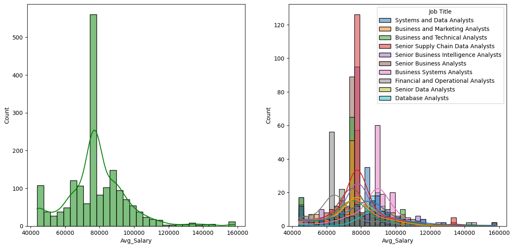

# Canada Software Job Trend in 2024

## [EDA](https://github.com/shadowdk3/canada_software_job_trend_in_2024/blob/master/notebook/EDA_Canada_Software_Job_Trend_2024.ipynb)

The puroise of this project is to master the exploratory data analsis (EDA) in Canada Software Job Trend in 2024

### Library

- numpy
- pandas
- seaborn
- matplotlib

### Data

- Job Title: A generalized job title that encapsulates the role.
- Job Info: The exact job title as listed on the job sites.
- Position: The specific role or category the job falls under.
- Employer: The name of the hiring company.
- City: The job's location.
- Province: The abbreviated province name corresponding to the city.
- Skill: The programming languages and tools required for the job.
- Seniority: The job's seniority level (Senior, Mid, Junior, any).
- Work Type: Specifies if the job is Remote, In-person, or Hybrid.
- Industry Type: The industry to which the employer belongs.
- Min Salary: The lowest salary listed (as a float).
- Max Salary: The highest salary listed (as a float).
- Average Salary: The mean salary (as a float).

### Visualize

#### Visualize the salary with the job title 

### Conclusions

- Salary data range: $30,240.56 to $180,000.00, with an average of $78,434.73.
- Distribution skew: Average aligns with 75th percentile, indicating right-skewed distribution.
- Job titles: Average salaries range from $66,000 to over $90,000; specialized roles command higher pay.
- Geographic trends: Quebec has highest average at $131,093.33; varied averages across regions.
- Industry disparities: Legal, Retail, Consulting offer competitive salaries; Real Estate, Travel show lower averages.
- Impact of skills and seniority: Skills like Bilingual, Tableau, Python, and senior roles lead to higher salaries.
- Work types and salaries: In-Person work type has highest average; Remote work type follows closely.
- Industry influences: Technology, Healthcare offer above $80,000 average salaries.
- Dataset overview: 1796 data points; mean salary $78,434.73, standard deviation $18,026.99.